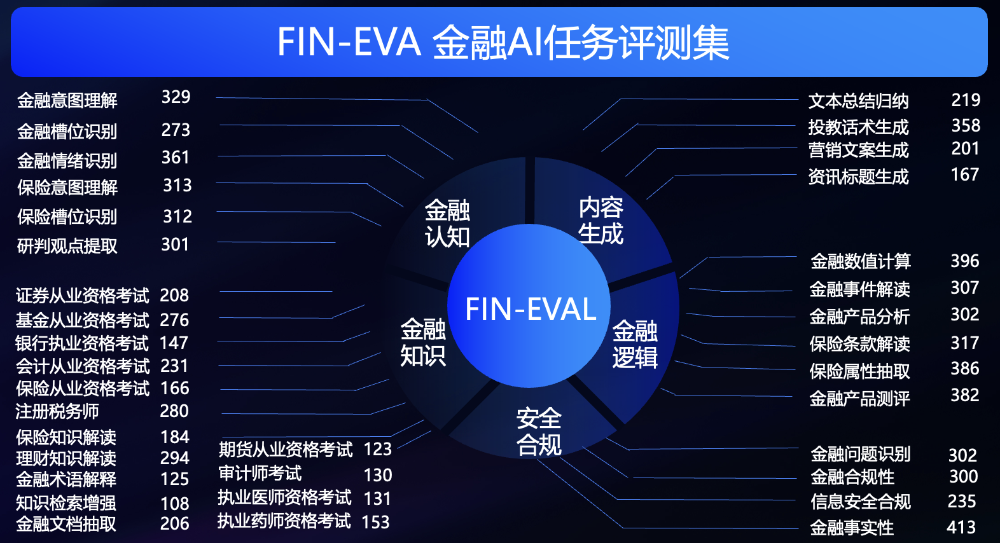

# Fin-Eva 金融领域中文语言专业数据评测集

## 简介
蚂蚁金融评测集Fin-Eva，覆盖财富管理、保险、投资研究等多个金融领域，数据源包括蚂蚁各业务领域数据、互联网公开数据，经过数据脱敏、文本聚类、语料精筛、数据改写等处理过程后，结合金融领域专家的评审最终构建而成。
维度方面涵盖金融认知、金融知识、金融逻辑、内容生成以及安全合规五大类能力33个子维度共8445个测评题，题目类型为单选题。
目前Fin-Eva对外开放评测数据，未来持续迭代并开放平台化评测托管服务，为行业提供一站式评估。

## 任务介绍
<p align="center">        </p>

| 五大能力  | 评估维度                      |
|-------|---------------------------|
| 金融认知类 | 考察大模型金融文本的理解和提取能力         |
| 金融知识类 | 考察大模型是否具备全面的金融领域知识        |
| 金融逻辑类 | 考察大模型是否具备完成复杂金融任务的推理和计算能力 |
| 内容生成类 | 考察大模型总结和生成专业金融文本的能力       |
| 安全合规类 | 考察大模型能否辨别金融领域的安全和合规问题     |

对于1.0.0版本，我们全部采用选择题这类有固定答案的问题，配合对应指令让模型输出标准格式。


## 构建数据
Fin-Eva的评测数据被划分为dev和test集。其中dev集为白盒，占总数的27.7%，包含组成问题的所需要素以及标准答案。test集为黑盒，占总数的72.3%，跟dev集的区别是缺少标准答案。
使用黑盒是为了保证评测的公正性，测评者可以通过白盒部分理解评测维度的细节。

测评数据在[data](data/)目录下，一级目录按能力维度进行划分，二级目录包含各子维度任务，每个数据文件前部是dev数据，后部是test数据，区别是answer列是否有值。

下面是一条数据样例

|  id   | context(option) | question | A   | B    | C    | D    | E(option) | answer |
|  ----  |-----------------|----------|-----|------|------|------|-----------|--------|
| 编号  | 分析的文章           | 问题题干     | 答案A | 答案B | 答案C | 答案D | 答案E       | 标准答案   |


根据金融大模型在蚂蚁各业务中落地的经验，Fin-Eva为五大类共33个子任务适配了相应的[prompt模板](src/utils/dataloader.py)，进而激发出金融大模型的最优效果。 

src/utils/dataloader.py 包含各子任务的prompt指令模版，将data目录下的数据集组装成完整的测评集，构建成最终的模型输入。prompt模版以下面两个子任务为例：
- 单选：理财知识解读
```
你是一名专业的理财专家，你对任何理财知识都了解，你需要从A、B、C、D四个选项中选出一个作为问题最恰当的回答，你只能输出一个字符，并且这个字符是A、B、C、D中一个。
理财问题：{question}
选项：
A.{A}
B.{B}
C.{C}
D.{D}
答：
```
- 判断：金融合规性
```
你是一名专业的金融行业金融合规审核员，你可以判断给定的输入包含的信息是否金融合规。
问题是：{question}
你的输出只能是“是”或者“否
```


## 代码库结构
```
FinEva
├── data # FinEva评测数据集
│   ├── 金融认知
│   ├── 金融知识
│   ├── 金融逻辑
│   ├── 内容生成
│   └── 安全合规
├── run_scripts # 评测执行的bash脚本
│   ├── run.sh # 执行所有模型的评测
│   ├── run_chatglm2.sh # 执行chatglm2模型的评测
│   ├── run_chatgpt.sh # 执行chatgpt模型的评测
│   └── ...
├── src # FinEva评测代码
│   ├── evaluator # 评测器
│   │   ├── chatglm2_evaluator # chatglm2评测器
│   │   ├── chatgpt_evaluator # chatgpt评测器
│   │   └── ...
│   ├── utils # 工具函数
│   │   ├── dataloader.py # 数据集导入
│   │   ├── file_utils.py # 文件处理
│   │   └── gpt_utils.py # chatgpt 相关工具
│   ├── exec_fineva_main.py # 入口
│   ├── get_score.py # 评测结果的计算
│   └── example.py # 数据集读取示例
├── LEGAL.md
└── README.md
```

## 快速开始
```shell
# 进入run_scripts目录
cd run_scripts

# 执行所有模型的评测
bash run.sh
# 执行chatglm2模型的评测
bash run_chatglm2.sh
# 执行chatgpt模型的评测
# 需要在src/utils/gpt_utils.py中填写OPENAI_API_KEY
# 需要在src/utils/exec_fineva_main.py中激活ChatGPTEvaluator
bash run_chatgpt.sh
# 执行qwen_14b模型的评测
bash run_qwen_14b.sh
...

参数说明
# 模型名称 
model_name="qwen14b"
# 模型加载路径 
model_path="../models/qwen/Qwen-14B-Chat"
# 数据集类型，dev和test集会在result_path下生成${model_name}_ga.csv的评测明细文件，dev集可以通过get_score.py进行评分，
dataset_type = "dev"
# 生成结果保存路径
result_path="../results"
```
自定义模型的评测需要实现 [src/evaluator/custom_evaluator.py](src/evaluator) 和 [run_scripts/run_custom_model.sh](run_scripts/)，

并需要在[src/utils/exec_fineva_main.py](src/utils/exec_fineva_main.py)中的load_evaluator类中引入custom_evaluator。


## 如何提交测试结果
如果参与自定义大模型在test集上的评测，则需要按照上面的方式增加对应的模型评估器，
并在评估sh脚本中将dataset_type参数设置为"test"，执行成功后会在${result_path}目录下生成${model_name}_ga.csv的结果。
请按照下面的格式发送邮件到 Fin-eval@antgroup.com 进行申请。

```
单位：
用途：
联系方式：
模型名称：
模型结果附件📎
```

## 许可证
[](https://creativecommons.org/licenses/by/4.0/)

Fin-Eval数据集遵循[Creative Commons Attribution 4.0 International License](https://creativecommons.org/licenses/by/4.0/)

