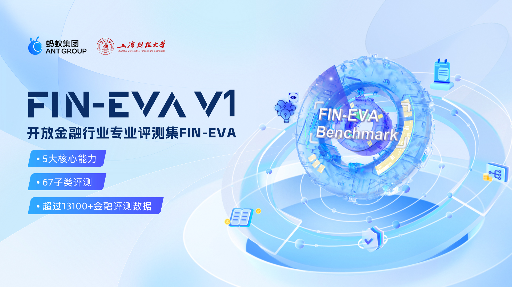
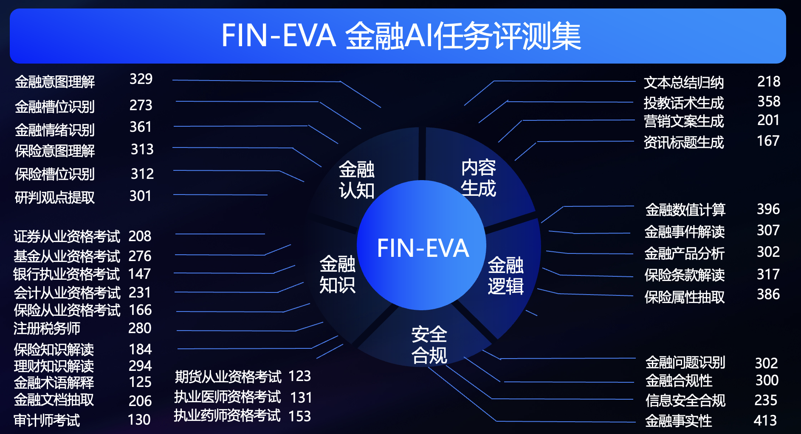
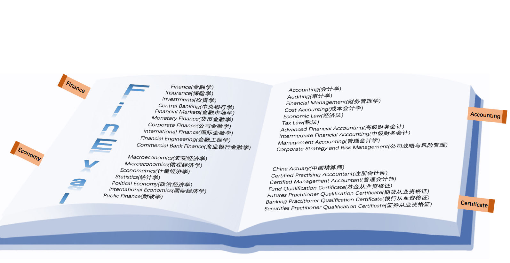

# Fin-Eva Version 1.0 金融领域中文语言专业数据评测集


## Fin-Eva Version 1.0

蚂蚁集团、上海财经大学联合推出金融评测集Fin-Eva Version 1.0，覆盖财富管理、保险、投资研究等多个金融场景以及金融专业主题学科，总评测题数目达到1.3w+。

蚂蚁数据源包括各业务领域数据、互联网公开数据，经过数据脱敏、文本聚类、语料精筛、数据改写等处理过程后，结合金融领域专家的评审构建而成。
上海财经大学数据源主要基于相关领域权威性考试的各类真题和模拟题对知识大纲的要求，由上海财经大学统计与管理学院张立文副教授课题组牵头，金融学院闵敏副教授及其他各学院老师协助完成，所有数据均为原创，这保证了数据源的准确性和权威性。

蚂蚁部分涵盖金融认知、金融知识、金融逻辑、内容生成以及安全合规五大类能力33个子维度共8445个测评题；
上财部分涵盖金融，经济，会计和证书等四大领域，包括4661个问题，涵盖34个不同的学科。


Fin-Eva Version 1.0 全部采用单选题这类有固定答案的问题，配合相应指令让模型输出标准格式。 

目前Fin-Eva Version 1.0对外开放评测数据，未来持续迭代并开放平台化评测托管服务，为行业提供一站式评估。

## 目录

- [任务介绍](#任务介绍)
- [数据构建](#数据构建)
- [代码库结构](#代码库结构)
- [快速开始](#快速开始)
- [如何提交测试结果](#如何提交测试结果)
- [社区共建倡议](#社区共建倡议)
- [许可证](#许可证)


## 任务介绍

蚂蚁         |  上财 
:-------------------------:|:-------------------------:
  |  
金融应用场景 |  金融领域多学科


蚂蚁重点考察金融大模型在多金融场景的知识理解和应用能力。

| 五大能力  | 蚂蚁评估维度                    |
|-------|---------------------------|
| 金融认知类 | 考察大模型金融文本的理解和提取能力         |
| 金融知识类 | 考察大模型是否具备全面的金融领域知识        |
| 金融逻辑类 | 考察大模型是否具备完成复杂金融任务的推理和计算能力 |
| 内容生成类 | 考察大模型总结和生成专业金融文本的能力       |
| 安全合规类 | 考察大模型能否辨别金融领域的安全和合规问题     |


上海财经大学重点考察金融大模型对在四大领域的能力，团队耗时三个月的时间，构造一个中文的、有足够区分度的、多学科的评测基准，命名为FinEval。
[FinEval金融Benchmark介绍](https://github.com/SUFE-AIFLM-Lab/FinEval/blob/main/README_zh-CN.md)

| 四大领域  | 上财评估维度                    |
|-------|---------------------------|
| 金融领域 | 为专业人员提供了做出明智金融决策和导航全球金融环境所需的关键技能         |
| 经济领域 | 着重于理解国家和全球经济系统，使个人能够分析经济趋势，并有效地为该领域作出贡献        |
| 会计领域 | 提供全面的财务管理和合规知识，塑造专业人员在财务决策制定和风险管理方面的专业技能 |
| 证书领域 | 包含精算、会计和金融等领域的证书考试，用于验证专业人员的知识和技能，增强职业前景和行业认可       |


## 数据构建
Fin-Eva v1的评测数据被划分为dev和test集。

其中dev集为白盒，占总数的28%，包含组成问题的所需要素以及标准答案。test集为黑盒，占总数的72%，跟dev集的区别是缺少标准答案。
使用黑盒是为了保证评测的公正性，测评者可以通过白盒部分理解评测维度的细节。

蚂蚁和上财整合的评测数据在[data](data/)目录下。 使用者可以通过执行[example.py](src/example.py)的dataloader快速加载数据。

蚂蚁评测数据的一级目录按能力维度进行划分，二级目录包含各子维度任务。每个数据文件前部是dev数据，后部是test数据，区别是answer列是否有值。
下面是一条数据样例

|  id   | context(option) | question | A   | B    | C    | D    | E(option) | answer |
|  ----  |-----------------|----------|-----|------|------|------|-----------|--------|
| 编号  | 分析的文章           | 问题题干     | 答案A | 答案B | 答案C | 答案D | 答案E       | 标准答案   |

根据金融大模型在蚂蚁各业务中落地的经验，Fin-Eva v1为五大类共33个子任务适配了相应的[prompt模板](src/utils/dataloader.py)，进而激发出金融大模型的最优效果。 

src/utils/dataloader.py 包含各子任务的prompt指令模版，将data目录下的数据集组装成完整的测评集，构建成最终的模型输入。prompt模版以下面两个子任务为例：
- 单选：理财知识解读
```
你是一名专业的理财专家，你对任何理财知识都了解，你需要从A、B、C、D四个选项中选出一个作为问题最恰当的回答，你只能输出一个字符，并且这个字符是A、B、C、D中一个。
理财问题：{question}
选项：
A.{A}
B.{B}
C.{C}
D.{D}
答：
```
- 判断：金融合规性
```
你是一名专业的金融行业金融合规审核员，你可以判断给定的输入包含的信息是否金融合规。
问题是：{question}
你的输出只能是“是”或者“否
```

上财评测数据通过[subject_map.json](data/SUFE/subject_map.json)组装，prompt模版统一为下面格式：
```
以下是中国关于{domain}考试的单项选择题，请选出其中的正确答案。
{question}
A.{A}
B.{B}
C.{C}
D.{D}
答案：
```

## 代码库结构
```
FinEva v1
├── data # FinEva v1评测数据集
│   ├──Ant # Ant评测数据
│   │   ├── 金融认知
│   │   ├── 金融知识
│   │   ├── 金融逻辑
│   │   ├── 内容生成
│   │   └── 安全合规
│   ├──SUFE # 上财评测数据
│   │   ├── dev
│   │   ├── val
│   │   ├── test
│   │   ├── subject_map.json
├── run_scripts # 评测执行的bash脚本
│   ├── run.sh # 执行所有模型的评测
│   ├── run_chatglm2.sh # 执行chatglm2模型的评测
│   ├── run_chatgpt.sh # 执行chatgpt模型的评测
│   └── ...
├── src # FinEva评测代码
│   ├── evaluator # 评测器
│   │   ├── chatglm2_evaluator # chatglm2评测器
│   │   ├── chatgpt_evaluator # chatgpt评测器
│   │   └── ...
│   ├── utils # 工具函数
│   │   ├── dataloader.py # 数据集导入
│   │   ├── file_utils.py # 文件处理
│   │   └── gpt_utils.py # chatgpt 相关工具
│   ├── exec_fineva_main.py # 入口
│   ├── get_score.py # 评测结果的计算
│   └── example.py # 数据集读取示例
├── LEGAL.md
└── README.md
```

## 快速开始
```shell
# 进入run_scripts目录
cd run_scripts

# 执行所有模型的评测
bash run.sh
# 执行chatglm2模型的评测
bash run_chatglm2.sh
# 执行chatgpt模型的评测
# 需要在src/utils/gpt_utils.py中填写OPENAI_API_KEY
# 需要在src/utils/exec_fineva_main.py中激活ChatGPTEvaluator
bash run_chatgpt.sh
# 执行qwen_14b模型的评测
bash run_qwen_14b.sh
...

参数说明
# 模型名称 
model_name="qwen14b"
# 模型加载路径 
model_path="../models/qwen/Qwen-14B-Chat"
# 数据集类型，dev和test集会在result_path下生成${model_name}_ga.csv的评测明细文件，dev集可以通过get_score.py进行评分，
dataset_type = "dev"
# 生成结果保存路径
result_path="../results"
```
自定义模型的评测需要实现 [src/evaluator/custom_evaluator.py](src/evaluator) 和 [run_scripts/run_custom_model.sh](run_scripts/)，

并需要在[src/utils/exec_fineva_main.py](src/utils/exec_fineva_main.py)中的load_evaluator类中引入custom_evaluator。


## 如何提交测试结果
如果参与自定义大模型在test集上的评测，则需要按照上面的方式增加对应的模型评估器，
并在评估sh脚本中将dataset_type参数设置为"test"，执行成功后会在${result_path}目录下生成${model_name}_ga.csv的结果。
请按照下面的格式发送邮件到 Fin-eval@antgroup.com ，并抄送 zhang.liwen@shufe.edu.cn 进行申请。

```
单位：
用途：
联系方式：
模型名称：
模型结果附件📎
```

## 社区共建倡议
金融专业评测集作为金融能力的标尺，对金融大模型的快速迭代是至关重要的。
需要由来自社会各界，尤其金融行业的教育院校、研究机构、单位、企业共同建设加强评测集的专业度、区分度、广度深度。

蚂蚁集团作为金融领域的创新者，致力于完善金融大模型的专业评测，联合上海财经大学开源Fin-Eva Version 1.0金融评测集。
如果您有金融评测需求，欢迎通过上面的方式提交获得结果。
如果您有意愿对Fin-Eva进行加强贡献，蚂蚁诚挚欢迎您加入共建，请联系 Fin-eval@antgroup.com。
为了明确您给予Fin-Eva的许可，按照社区惯例，我们需要您在贡献前签署[FIN-EVA数据集贡献者许可协议](FIN-EVA数据集贡献者许可协议.docx)。


## 许可证
[](https://creativecommons.org/licenses/by/4.0/)

Fin-Eval数据集遵循[Creative Commons Attribution 4.0 International License](https://creativecommons.org/licenses/by/4.0/)

