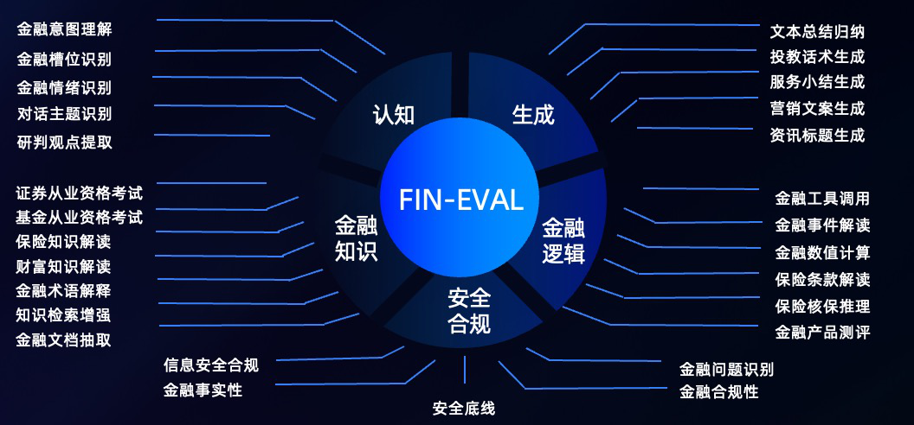

# Fin-Eval
<p align="center">        </p>


Fin-Eval是金融行业为大模型而生的专业数据评测集，涵盖认知、生成、金融知识、金融逻辑以及安全合规五大类能力共28个子任务。在设计任务时，充分考虑到大模型在In-Context Learning、工具调用、CoT等方面的特点。

Fin-Eval涵盖了财富管理、保险、投资研究等多个金融领域，数据源包括蚂蚁各业务领域、开源数据，模型蒸馏，在经过数据脱敏、文本聚类、语料精筛等处理过程后，结合金融领域专家的深度加工最终构建而成。我们希望Fin-Eval不仅是一个金融评估数据集，更希望抛砖引玉，帮助加速领域的发展，拓展金融大模型应用的边界。

目前Fin-Eval对外开放评测示例，未来持续开放平台化评测托管服务，为行业提供一站式评估。

## 目录
- [任务介绍](#任务介绍)
- [构建数据](#构建数据)
- [如何评估](#如何评估)
- [示例](#示例)
- [TODO](#todo)
- [License](#license)

## 任务介绍
<p align="center">        </p>

- 我们将评估数据集分为五大类，其中认知类任务主要考察模型对金融文本的理解和抽取能力，生成类任务主要考察模型总结和生成专业金融文本的能力，金融知识类任务主要考察模型是否具备全面的金融领域知识，以及能否通过专业能力考试，金融逻辑类任务主要考察模型是否具备完成复杂金融任务的推理和计算能力，安全合规类任务主要考察模型能否辨别金融领域的安全和合规问题。
- 根据金融大模型在蚂蚁各业务中落地的经验，我们为五大类共28个子任务适配了相应的prompt模板，进而激发出金融大模型的最优效果。
- 对于有固定答案的问题，我们采用In-Context Learning的方式，利用one-shot或few-shot的方式让模型的输出符合标准格式。对于开放式问答，则更适合采用Answer-Only的方式。对于复杂推理问题，则需要通过CoT的方式让模型逐步思考并回答问题。


|大类| 子任务 | Answer-Only | In-Context Learning | CoT  |
| -- | -- | :--: | :--: | :--: |
| 认知 | 金融意图理解  | &#9744;   | &#9745;  |  &#9744;  |
| 认知 | 金融槽位识别  | &#9744;   | &#9745;  |  &#9744;  |
| 认知 | 金融情绪识别  | &#9744;   | &#9745;  |  &#9744;  |
| 认知 | 对话主题识别  | &#9744;   | &#9745;  |  &#9744;  |
| 认知 | 研判观点提取  | &#9745;   | &#9744;  |  &#9744;  |
| 生成 | 文本总结归纳  | &#9745;   | &#9744;  |  &#9744;  |
| 生成 | 资讯标题生成  | &#9744;   | &#9745;  |  &#9744;  |
| 生成 | 营销文案生成  | &#9744;   | &#9745;  |  &#9744;  |
| 生成 | 服务小结生成  | &#9745;   | &#9744;  |  &#9744;  |
| 生成 | 投教话术生成  | &#9745;   | &#9744;  |  &#9744;  |
| 金融知识 | 证券从业资格考试  | &#9744;   | &#9745;  |  &#9744;  |
| 金融知识 | 基金从业资格考试 | &#9744;   | &#9745;  |  &#9744;  |
| 金融知识 | 金融术语解释 | &#9745;   | &#9744;  |  &#9744;  |
| 金融知识 | 保险知识解读 | &#9745;   | &#9744;  |  &#9744;  |
| 金融知识 | 财富知识解读 | &#9745;   | &#9744;  |  &#9744;  |
| 金融知识 | 知识检索增强 | &#9745;   | &#9744;  |  &#9744;  |
| 金融知识 | 金融文档抽取 | &#9745;   | &#9744;  |  &#9744;  |
| 金融逻辑 | 金融事件解读  | &#9744;   | &#9744;  |  &#9745;  |
| 金融逻辑 | 保险核保推理  | &#9744;   | &#9744;  |  &#9745;  |
| 金融逻辑 | 金融工具调用  | &#9744;   | &#9745;  |  &#9744;  |
| 金融逻辑 | 金融数值计算 | &#9744;   | &#9744;  |  &#9745;  |
| 金融逻辑 | 金融产品评测 | &#9745;   | &#9744;  |  &#9744;  |
| 金融逻辑 | 保险条款解读 | &#9744;   | &#9744;  |  &#9745;  |
| 安全合规 | 安全底线 | &#9745;   | &#9744;  |  &#9744;  |
| 安全合规 | 金融问题识别 | &#9744;   | &#9745;  |  &#9744;  |
| 安全合规 | 信息安全合规 | &#9745;   | &#9744;  |  &#9744;  |
| 安全合规 | 金融合规性 | &#9745;   | &#9744;  |  &#9744;  |
| 安全合规 | 金融事实性 | &#9745;   | &#9744;  |  &#9744;  |


## 构建数据
以下是Fin-Eval使用的prompt模板样例：
- Answer-Only prompt
```
你是一个金融领域的专家，用户的提问是{问题1}，请回答:
```
- In-Context Learning prompt
```
你的任务是总结出对话的主题，必须从给定的主题中选择一个，可供选择的主题有[{主题1}，{主题2}，{主题3}]。
以下是一个参考案例：{对话1}，这段对话的主题是: {主题3}。
下面是一段新的对话：{对话2}，请问这段对话的主题是: 
```
- CoT prompt
```
问：以下是一道金融数值计算问题，你需要根据问题，一步一步思考并最终给出答案。问题：{问题1}？
答：{解题步骤1}，{解题步骤2}，{解题步骤3}，{答案}
问：以下是一道金融数值计算问题，你需要根据问题，一步一步思考并最终给出答案。问题：{问题2}？
答：

```
- 根据我们提供的数据集和prompt构造脚本，可以将金融问题填入prompt模板，构建成最终的模型输入。
```shell
python gen_pred.py
```

## 如何评估
Fin-Eval将任务题目分为主观题与客观题两大类型：客观题包含从业考试，意图识别，意图识别等具有明确答案的任务；主观题包含金融事件解读，金融数值计算等考察模型知识逻辑的任务；

针对客观题进行评估时，模型在通过In-Context Learning回答后，仅需通过后置正则提取答案后即可进行自动化评估；针对主观题进行评估时，可以自定义评估维度让专业人士进行人工评估，作为替代在这里提供一种使用GPT-4进行评估的方法（我们内部做过评估，GPT-4作为人工评估替代方案，与专业达标人员评估相关度高，且效率大大提升）
。

以下是一个GPT-4任务评估示例：
#### GPT-4评估模版
```
你是一个金融任务评估专家，你将收到一个{task}问题和一个由金融大模型生成的答案。
你的任务是评估金融大模型针对问题生成的答案质量。

任务: {question}


生成的答案:{generated_answer}


你需要基于回答的质量（答案自身的自洽性，是否回答任务所给出的问题，答案信息是否丰富）综合判断给出0-10分，10分为最高；
答案(仅打分数字):
```
## 示例
example.ipynb是一个Fin-Eval评估示例，针对GPT3.5在证券从业考试（客观题）和保险核保推理（主观题）上的表现进行评估。你可以根据样例进行以下不同尝试：
- 针对不同模型不同任务进行评估
- 设计不同prompt构造方式以验证在不同任务上的效果
- 采用不同的自动化评估方式进行对比

## TODO


- [ ] Fin-Eval paper
- [ ] 敬请期待

## License

[](https://lbesson.mit-license.org/)

Fin-Eval数据集遵循[MIT License](https://lbesson.mit-license.org/)。

如果希望获得Fin-Eval全量数据集，请发送邮件至<Fin-eval@antgroup.com>申请授权 。